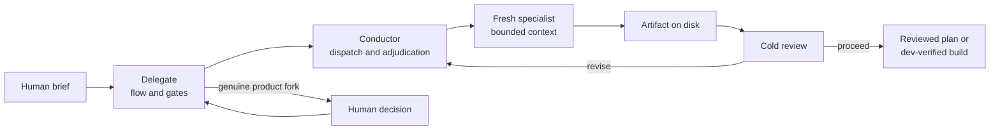

# The Bureau

Novadiem Studio's agentic engineering system for turning complex software briefs into reviewed, traceable delivery.

[Explore the Bureau](https://thebureau.dev) | [Read the Novadiem case study](https://novadiem.com/bureau) | [Browse the Records](https://thebureau.dev/records) | [Work with Novadiem](https://novadiem.com/contact)


The Bureau routes work through isolated specialist agents, carries decisions forward in durable artifacts, and places explicit gates around review, external actions, and production boundaries. Novadiem uses it to plan, build, review, and document software across studio projects.

This repository is a public view of a working studio system. It is here for technical evaluation and to show how Novadiem approaches agentic engineering. It is not currently packaged or supported as a self-serve product.

## Why it exists

Coding models can produce useful work, but a long software job still needs someone to hold the structure together.

A single session tends to accumulate several jobs at once. It interprets the brief, argues for an architecture, writes the implementation, and then reviews the choices it already made. Important decisions remain trapped in chat history. If the session is interrupted, the next one has to reconstruct what happened and decide which parts of the conversation were authoritative.

The Bureau moves those responsibilities into a workflow:

- Tasks are classified before an agent is chosen.
- Specialists work in fresh contexts with narrow responsibilities.
- Handoffs are written to files, not left in conversation history.
- Reviewers see controlled evidence instead of the discussion that produced it.
- Human judgment remains at genuine product forks and external-action boundaries.
- Interrupted work resumes from state and artifacts on disk.

The model is one component. The routing, boundaries, evidence, and paper trail are the system.

## How a run moves

The default topology has two coordination layers. The Delegate manages routine flow and gates. It keeps one resumable Conductor, which dispatches fresh specialists and adjudicates their findings.



The exact path depends on the task. A bug fix does not need the same ceremony as a new product feature. The Conductor reads the [workflow registry](workflows/index.md), selects the smallest fitting workflow, and records that choice before work begins.

## What the system protects

### Independent review

Specialists are spawned without the manager's conversation. A reviewer does not watch a design get negotiated and then pretend to encounter it for the first time.

For integrated checkpoint review, the Bureau stages a bounded packet, excludes the live run log and transcript-like material, and asks an ephemeral reviewer for a structured verdict. The packet and verdict are tied to the artifacts being reviewed. See [the host runtime contract](docs/host-runtime.md) and [the integrated Delegate bridge](docs/delegate-bridge/v2-integrated.md).

### Artifact memory

The conversation is not the source of truth. A run writes its state, decisions, specifications, plans, reviews, prompts, and build evidence into a dedicated directory. Another Conductor can resume from that record without inheriting the previous session's transcript.

[Anatomy of a Run](https://thebureau.dev/records/anatomy-of-a-run) walks through the paper trail in plain language. The mechanical contract lives in [the run protocol](docs/run-protocol.md).

### Human judgment

The Bureau can continue through routine, written gates. It stops when the remaining question requires a product choice, new authority, or an external action that the task did not already authorize.

Build workflows stop at the development boundary unless a separate, explicit production action is approved. The standing rules are documented in [the Conductor gates](docs/conductor-gates.md) and [the external-action boundary](docs/external-action-boundary.md).

### Isolated code changes

Code-changing runs receive their own branch and worktree. Concurrent runs can work against the same repository without sharing a checkout or writing directly to the integration branch. The worktree lifecycle is defined in [the git worktree contract](docs/git-worktree.md).

### Honest accounting

The close-out record distinguishes exact, estimated, inferred, partial, and unavailable evidence. Missing provider data is recorded as unavailable rather than counted as zero. See [run accounting](docs/run-accounting.md).

### Lessons that outlive the run

Repeated failures are promoted into conventions, scripts, or committed regression fixtures. The standing regression suite protects mechanical guarantees such as artifact binding, verdict validation, run isolation, accounting integrity, and fail-closed gates.

The suite and its promotion lifecycle are documented in [`.bureau/regression/README.md`](.bureau/regression/README.md). Framework-level consistency checks live in [`check-framework.sh`](check-framework.sh).

## Workflows

The Bureau is a dispatcher, not one fixed pipeline. Its registered workflows currently cover:

| Workflow | Purpose | Typical result |
|---|---|---|
| [`feature`](workflows/feature.md) | Define a substantial feature or new product | Requirements, architecture, plan, and scoped prompts |
| [`bug-fix`](workflows/bug-fix.md) | Reproduce, locate, fix, and verify a known defect | Code change, regression test, cold diff review, and dev verification |
| [`build-review-cold`](workflows/build-review-cold.md) | Build a contained change with risk-triggered cold review | Dev-verified change with review when silent failure is plausible |
| [`execute-plan`](workflows/execute-plan.md) | Turn an approved plan into vetted prompts and build them | Isolated implementation with per-part review |
| [`design-build`](workflows/design-build.md) | Implement an existing design handoff | Design manifest, build prompts, implementation, and fidelity review |
| [`code-review`](workflows/code-review.md) | Review a branch, pull request, diff, or working tree | Findings-first cold review with no edits by default |
| [`docs-reconcile`](workflows/docs-reconcile.md) | Reconcile planning or status documents with code | Updated documents rechecked against repository ground truth |
| [`operational-build`](workflows/operational-build.md) | Run a defined build or operations runbook | Verified build or operations record, stopping before production |
| [`message-framing`](workflows/message-framing.md) and [`copy-review`](workflows/copy-review.md) | Frame and review public-facing language | Audience-aware copy with a separate voice pass |
| [`write-article`](workflows/write-article.md) | Produce a long-form article through staged review | Versioned drafts, grounding, cold proof, and a publish gate |

The complete and current list lives in [`workflows/index.md`](workflows/index.md). A task that does not fit an existing entry triggers workflow definition instead of being forced through the feature pipeline.

## The cast

The names give the system a memorable working language. The responsibilities remain concrete.

| Role | Responsibility |
|---|---|
| [The Delegate](agents/delegate.md) | Routine flow and checkpoint gating at the top level |
| [The Conductor](agents/orchestrator.md) | Triage, dispatch, adjudication, state, and close-out |
| [Analizer 2000](agents/analyst.md) | Requirements, assumptions, edge cases, and acceptance criteria |
| [The Architect](agents/architect.md) | Architecture, dependency mapping, and phased plans |
| [The Challenger](agents/critic.md) | Cold review of specifications, prompts, code, and evidence |
| [The Cleric](agents/designer.md) | Design need, design handoff, and fidelity review |
| [The Spellwright](agents/prompt-engineer.md) | Scoped build instructions from approved plans |
| [The Mage](agents/frontend.md) | Frontend implementation |
| [The Systemsmith](agents/backend.md) | Backend implementation and contracts |
| [The Mechanic](agents/sysadmin.md) | Builds, infrastructure, and operations tasks |
| [The Counselor](agents/voice.md) | Audience framing and public-copy review |
| [The Witness](agents/witness.md) | Cross-run status and studio briefings |
| [The Coupler](agents/coupler.md) | Verification where parallel build surfaces meet |
| [The Notary](agents/notary.md) | External cold attestation of a sealed artifact packet |

Cast identities and voice live in [`LORE.md`](LORE.md). Mechanics take precedence when lore and runtime behavior differ.

## Run artifacts

Each task owns one `RUN_DIR`. For a targeted repository, new runs live under:

```text
<target-repo>/.bureau/runs/<yyyymmdd>-<task-slug>/
```

The exact artifact set depends on the workflow. Common files include:

| Artifact | Purpose |
|---|---|
| `state.json` | Short, machine-readable run state |
| `log.md` | Append-only human record of spawns, decisions, findings, and handoffs |
| `model-routing.json` | Runtime, model, and reasoning assignment by role |
| `spec.md` | Requirements and architecture when the workflow calls for them |
| `plan.md` | Phased delivery plan |
| `prompts.md` or a prompt folder | Approved, scoped build instructions |
| `design/` | Design brief, handoff, and manifest when a visual surface is involved |
| `coupling/` | Evidence from cross-surface integration checks |
| `regression/` | Run-local regression fixtures before promotion |
| `accounting.json` | Close-out record with evidence confidence |

The artifacts allow concurrent runs, inspection after the fact, and recovery after a session ends.

## Runtime support

The Bureau separates provider-neutral model routing from the host transport that creates agent contexts.

| Runtime | Agent host | Status |
|---|---|---|
| Claude | Claude Code Agent tool | Supported |
| OpenAI | Codex collaboration tools | Supported |
| Codex | Alias for OpenAI at startup and reviewer boundaries | Supported |
| OpenRouter | Model routing only | No native run transport; fails closed |
| Hermes | Model routing only | No native run transport; fails closed |

Every specialist receives an explicit model assignment from the run's routing file. The framework does not silently inherit the manager's model. Current mappings and known accounting gaps are documented in [`docs/host-runtime.md`](docs/host-runtime.md), [model routing and cast](docs/model-routing-and-cast.md), and [`config/runtimes/README.md`](config/runtimes/README.md).

## Repository map

| Path | What it contains |
|---|---|
| [`agents/`](agents/) | Specialist contracts, output formats, and boundaries |
| [`workflows/`](workflows/) | Task-specific routing and execution paths |
| [`docs/`](docs/) | Runtime, run-state, gate, worktree, accounting, and convention contracts |
| [`scripts/`](scripts/) | Deterministic helpers for startup, verification, review, accounting, and close-out |
| [`config/`](config/) | Model policy, runtime adapters, schemas, and experiments |
| [`templates/`](templates/) | Run state, project context, accounting, and decision templates |
| [`.bureau/regression/`](.bureau/regression/) | Committed regression fixtures for framework behavior |
| [`reference/`](reference/) | Visual references and design canon |

## Operator documentation

The public README describes the system. The operational contracts remain in the repository:

- Codex entrypoint and repository rules: [`AGENTS.md`](AGENTS.md) and [`CODEX.md`](CODEX.md)
- Claude Code entrypoint: [`CLAUDE.md`](CLAUDE.md)
- Workflow selection: [`workflows/index.md`](workflows/index.md)
- Run lifecycle: [`docs/run-protocol.md`](docs/run-protocol.md)
- Host transport and isolation: [`docs/host-runtime.md`](docs/host-runtime.md)
- Existing-project behavior: [`docs/existing-project-mode.md`](docs/existing-project-mode.md)
- Worktree isolation: [`docs/git-worktree.md`](docs/git-worktree.md)
- Gates and external actions: [`docs/conductor-gates.md`](docs/conductor-gates.md) and [`docs/external-action-boundary.md`](docs/external-action-boundary.md)
- Accounting: [`docs/run-accounting.md`](docs/run-accounting.md)
- Script reference: [`scripts/README.md`](scripts/README.md)
- External dependencies: [`DEPENDENCIES.md`](DEPENDENCIES.md)

These documents assume a capable operator working from the repository. Novadiem does not currently provide a beginner installer, hosted control plane, or general installation support.

## Status and availability

The Bureau is in active development and changes as Novadiem learns from real runs. Interfaces, workflow contracts, model mappings, and operator instructions may change without a stable release boundary.

The repository is public so clients and technical peers can inspect the work. If you want the Bureau applied to a product, an existing codebase, or an agent workflow, [work with Novadiem](https://novadiem.com/contact).

## License and use

No open-source license is currently attached to this repository. Public visibility should not be read as a supported self-serve distribution. Contact [Novadiem Studio](https://novadiem.com/contact) to discuss project use or commercial terms.

## Further reading

- [The Bureau](https://thebureau.dev), the public site, cast, records, and visual system
- [Novadiem case study](https://novadiem.com/bureau), the studio view of the system and the problem it addresses
- [The Harness Is the Product](https://thebureau.dev/the-harness-is-the-product), why the coordination layer matters
- [Who Checks the Checker?](https://thebureau.dev/who-checks-the-checker), what happened when several reviewers agreed and the repo-aware reviewer did not
- [Gate the Flow, Not the Judgment](https://thebureau.dev/gate-the-flow-not-the-judgment), how routine gates differ from product decisions
- [The Pipeline That Wrote This](https://thebureau.dev/the-pipeline-that-wrote-this), a Bureau workflow described by an article it produced
- [The Gates](https://thebureau.dev/records/the-gates), the standing decision boundaries
- [Cast and Routing](https://thebureau.dev/records/cast-and-routing), the public map of roles and handoffs

## Work with Novadiem

The Bureau is part of how Novadiem Studio delivers software. It is not the service by itself.

If you have a product to define, a difficult codebase to move forward, or an agent workflow that needs stronger structure and review, [start a conversation with Novadiem](https://novadiem.com/contact).
