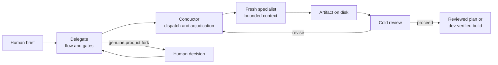

# The Bureau

A multi-agent workflow that Novadiem Studio uses to plan, build, review and document software.

[Explore the Bureau](https://thebureau.dev) | [Read the Novadiem case study](https://novadiem.com/bureau) | [Browse the Records](https://thebureau.dev/records) | [Work with Novadiem](https://novadiem.com/contact)


The Bureau assigns work to specialists in separate contexts and saves their decisions and output to files. Review checkpoints determine whether work can continue, needs revision or requires a human decision. External actions and production deployments have their own authorization rules.

This is the system we use across studio projects, published for technical evaluation. It is in active development and is not packaged or supported as a self-serve product.

The [checkpoint review tour](docs/checkpoint-review-tour.md) follows a review through the code and tests, including what the checks cannot establish.

## Why it exists

Long software jobs need decisions and handoffs to survive beyond one model session.

A single session often interprets the brief, chooses an architecture, writes the code and reviews its own choices. Decisions can get buried in chat history. After an interruption, the next session has to reconstruct what happened and which decisions still apply.

The Bureau separates those responsibilities:

- Tasks are classified before an agent is chosen.
- Specialists work in fresh contexts with narrow responsibilities.
- Handoffs are written to files.
- Reviewers see controlled evidence instead of the discussion that produced it.
- Product choices and actions outside the task's authority go back to the human owner.
- Interrupted work resumes from state and artifacts on disk.

## How a run moves

By default, a single run has two coordinators. The Delegate manages checkpoints and keeps one resumable Conductor. The Conductor assigns work to fresh specialists and assesses their findings. For a planned series of runs, the Envoy reads an `INDEX.md`, launches each run through its own Delegate and supervises one run at a time.


```mermaid
flowchart LR
    A["Human brief"] --> B["Delegate<br/>flow and gates"]
    B --> C["Conductor<br/>dispatch and adjudication"]
    C --> D["Fresh specialist<br/>bounded context"]
    D --> E["Artifact on disk"]
    E --> F["Cold review"]
    F -->|revise| C
    F -->|proceed| G["Reviewed plan or<br/>dev-verified build"]
    B -->|genuine product fork| H["Human decision"]
    H --> B
```

The Conductor selects the smallest workflow that fits the task from the [workflow registry](workflows/index.md) and records the choice before work begins. Bug fixes and new product features follow different paths.

## What the system protects

### Independent review

Specialists start without the manager's conversation. Reviewers examine the written work in a fresh context, without the discussion that produced it.

For integrated checkpoint review, the Bureau prepares an evidence packet and starts a temporary reviewer. The packet excludes the full run log and transcript-like material. The response must identify the artifacts under review and match their hashes. See [the host runtime contract](docs/host-runtime.md) and [the integrated Delegate bridge](docs/delegate-bridge/v2-integrated.md).

### Artifact memory

Each run has a directory containing its state, decisions, specifications, plans, reviews, prompts and build evidence. Another Conductor can resume from those files without the previous session's transcript.

[Anatomy of a Run](https://thebureau.dev/records/anatomy-of-a-run) explains the record a run leaves behind. The [run protocol](docs/run-protocol.md) defines how it is written and used.

### Human judgment

The Bureau can continue when routine checks pass. It stops for product choices, new authority or external actions the task has not already authorized.

Build workflows stop at the development boundary unless a separate, explicit production action is approved. The standing rules are documented in [the Conductor gates](docs/conductor-gates.md) and [the external-action boundary](docs/external-action-boundary.md).

### Isolated code changes

Code-changing runs receive their own branch and worktree. Concurrent runs can work against the same repository without sharing a checkout or writing directly to the integration branch. The [git worktree contract](docs/git-worktree.md) defines setup, integration and cleanup.

For public GitHub repositories, the delivery unit is a linked issue and pull request: Bureau opens
a draft early, publishes test and cold-review evidence, marks it ready only after review passes,
and merges through GitHub. Private repositories may opt in; non-GitHub work keeps an explicit local
fallback. See [GitHub delivery](docs/github-delivery.md).

### Run accounting

The close-out record distinguishes exact, estimated, inferred, partial, and unavailable evidence. Missing provider data is recorded as unavailable rather than counted as zero. See [run accounting](docs/run-accounting.md).

### Regression checks

Lessons from repeated failures become conventions, script changes or committed regression fixtures. The standing suite checks artifact binding, verdict validation, run isolation, accounting integrity and gates that refuse to proceed when required evidence is missing or invalid.

[`.bureau/regression/README.md`](.bureau/regression/README.md) explains the suite and how run-local fixtures enter it. [`check-framework.sh`](check-framework.sh) checks consistency across framework files.

## Workflows

The registered workflows cover different kinds of work:

| Workflow | Purpose | Typical result |
|---|---|---|
| [`feature`](workflows/feature.md) | Define a substantial feature or new product | Requirements, architecture, plan, and scoped prompts |
| [`bug-fix`](workflows/bug-fix.md) | Reproduce, locate, fix, and verify a known defect | Code change, regression test, cold diff review, and dev verification |
| [`build-review-cold`](workflows/build-review-cold.md) | Build a contained change with risk-triggered cold review | Dev-verified change with review when silent failure is plausible |
| [`execute-plan`](workflows/execute-plan.md) | Turn an approved plan into vetted prompts and build them | Isolated implementation with per-part review |
| [`design-build`](workflows/design-build.md) | Implement an existing design handoff | Design manifest, build prompts, implementation, and fidelity review |
| [`code-review`](workflows/code-review.md) | Review a branch, pull request, diff, or working tree | Findings-first cold review with no edits by default |
| [`upstream-contribution`](workflows/upstream-contribution.md) | Contribute a real fix to an unrelated dependency or tool | Focused, tested, cold-reviewed upstream pull request |
| [`docs-reconcile`](workflows/docs-reconcile.md) | Reconcile planning or status documents with code | Updated documents rechecked against repository ground truth |
| [`operational-build`](workflows/operational-build.md) | Run a defined build or operations runbook | Verified build or operations record, stopping before production |
| [`message-framing`](workflows/message-framing.md) and [`copy-review`](workflows/copy-review.md) | Frame and review public-facing language | Audience-aware copy with a separate voice pass |
| [`write-article`](workflows/write-article.md) | Produce a long-form article through staged review | Versioned drafts, grounding, cold proof, and a publish gate |

[`workflows/index.md`](workflows/index.md) has the complete list. When no entry fits, the Conductor defines a workflow before proceeding.

## The cast

Each named role has a written contract:

| Role | Responsibility |
|---|---|
| [The Envoy](agents/envoy.md) | Cross-run supervisor when pointed at a plan; launches each run as a Delegate |
| [The Delegate](agents/delegate.md) | Routine flow and checkpoint gating for a single run |
| [The Conductor](agents/orchestrator.md) | Triage, dispatch, adjudication, state, and close-out |
| [Analizer 2000](agents/analyst.md) | Requirements, assumptions, edge cases, and acceptance criteria |
| [The Architect](agents/architect.md) | Architecture, dependency mapping, and phased plans |
| [The Challenger](agents/critic.md) | Cold review of specifications, prompts, code, and evidence |
| [The Cleric](agents/designer.md) | Design need, design handoff, and fidelity review |
| [The Spellwright](agents/prompt-engineer.md) | Scoped build instructions from approved plans |
| [The Mage](agents/frontend.md) | Frontend implementation |
| [The Systemsmith](agents/backend.md) | Backend implementation and contracts |
| [The Mechanic](agents/sysadmin.md) | Builds, infrastructure, and operations tasks |
| [The Counselor](agents/voice.md) | Audience framing and public-copy review |
| [The Witness](agents/witness.md) | Cross-run status and studio briefings |
| [The Coupler](agents/coupler.md) | Verification where parallel build surfaces meet |
| [The Notary](agents/notary.md) | External cold attestation of a sealed artifact packet |

Cast identities and voice live in [`LORE.md`](LORE.md). Mechanics take precedence when lore and runtime behavior differ.

## Run artifacts

Each task owns one `RUN_DIR`. For a targeted repository, new runs live under:

```text
<target-repo>/.bureau/runs/<yyyymmdd>-<task-slug>/
```

The exact artifact set depends on the workflow. Common files include:

| Artifact | Purpose |
|---|---|
| `state.json` | Short, machine-readable run state |
| `log.md` | Append-only human record of spawns, decisions, findings, and handoffs |
| `model-routing.json` | Runtime, model, and reasoning assignment by role |
| `spec.md` | Requirements and architecture when the workflow calls for them |
| `plan.md` | Phased delivery plan |
| `prompts.md` or a prompt folder | Approved, scoped build instructions |
| `design/` | Design brief, handoff, and manifest when a visual surface is involved |
| `coupling/` | Evidence from cross-surface integration checks |
| `regression/` | Run-local regression fixtures before promotion |
| `accounting.json` | Close-out record with evidence confidence |

## Runtime support

Model routing chooses which model a role uses. The host transport creates and resumes its agent context.

| Runtime | Agent host | Status |
|---|---|---|
| Claude | Claude Code Agent tool | Supported |
| OpenAI | Codex collaboration tools | Supported |
| Codex | Alias for OpenAI at startup and reviewer boundaries | Supported |
| OpenRouter | Model routing only | No native run transport; fails closed |
| Hermes | Model routing only | No native run transport; fails closed |

Every specialist receives an explicit model assignment from the run's routing file. Current mappings and known accounting gaps are documented in [`docs/host-runtime.md`](docs/host-runtime.md), [model routing and cast](docs/model-routing-and-cast.md), and [`config/runtimes/README.md`](config/runtimes/README.md).

## Repository map

| Path | What it contains |
|---|---|
| [`agents/`](agents/) | Specialist contracts, output formats, and boundaries |
| [`workflows/`](workflows/) | Task-specific routing and execution paths |
| [`docs/`](docs/) | Runtime, run-state, gate, worktree, accounting, and convention contracts |
| [`scripts/`](scripts/) | Deterministic helpers for startup, verification, review, accounting, and close-out |
| [`config/`](config/) | Model policy, runtime adapters, schemas, and experiments |
| [`templates/`](templates/) | Run state, project context, accounting, and decision templates |
| [`.bureau/regression/`](.bureau/regression/) | Committed regression fixtures for framework behavior |
| [`reference/`](reference/) | Visual references and design canon |

## Operator documentation

Start with the entrypoint for your host, then load the contracts needed for the task:

- Codex entrypoint and repository rules: [`AGENTS.md`](AGENTS.md) and [`CODEX.md`](CODEX.md)
- Claude Code entrypoint: [`CLAUDE.md`](CLAUDE.md)
- Grok Bot entrypoint: [`GROK.md`](GROK.md)
- Cursor Agent entrypoint: [`CURSOR.md`](CURSOR.md)
- Workflow selection: [`workflows/index.md`](workflows/index.md)
- Run lifecycle: [`docs/run-protocol.md`](docs/run-protocol.md)
- Host transport and isolation: [`docs/host-runtime.md`](docs/host-runtime.md)
- Existing-project behavior: [`docs/existing-project-mode.md`](docs/existing-project-mode.md)
- Worktree isolation: [`docs/git-worktree.md`](docs/git-worktree.md)
- Gates and external actions: [`docs/conductor-gates.md`](docs/conductor-gates.md) and [`docs/external-action-boundary.md`](docs/external-action-boundary.md)
- Accounting: [`docs/run-accounting.md`](docs/run-accounting.md)
- Script reference: [`scripts/README.md`](scripts/README.md)
- External dependencies: [`DEPENDENCIES.md`](DEPENDENCIES.md)

These documents assume an operator working from the repository. Novadiem does not currently provide a beginner installer, hosted control plane or general installation support.

## Status and availability

The Bureau changes as we use it. Interfaces, workflow contracts, model mappings and operator instructions may change without a stable release boundary.

## License and use

No open-source license is currently attached to this repository. Public visibility should not be read as a supported self-serve distribution. Contact [Novadiem Studio](https://novadiem.com/contact) to discuss project use or commercial terms.

## Further reading

- [The Bureau](https://thebureau.dev), the public site, cast, records, and visual system
- [Novadiem case study](https://novadiem.com/bureau), the studio view of the system and the problem it addresses
- [The Harness Is the Product](https://thebureau.dev/the-harness-is-the-product), why the coordination layer matters
- [Who Checks the Checker?](https://thebureau.dev/who-checks-the-checker), what happened when several reviewers agreed and the repo-aware reviewer did not
- [Gate the Flow, Not the Judgment](https://thebureau.dev/gate-the-flow-not-the-judgment), how routine gates differ from product decisions
- [The Pipeline That Wrote This](https://thebureau.dev/the-pipeline-that-wrote-this), a Bureau workflow described by an article it produced
- [The Gates](https://thebureau.dev/records/the-gates), the standing decision boundaries
- [Cast and Routing](https://thebureau.dev/records/cast-and-routing), the public map of roles and handoffs

## Work with Novadiem

To discuss using the Bureau to define a product, improve an existing codebase or build an agent workflow, [contact Novadiem](https://novadiem.com/contact).
